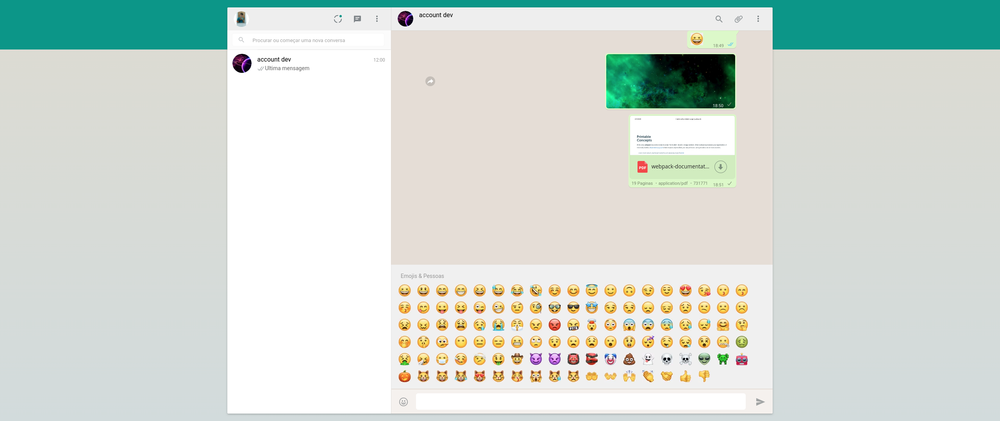

# Whatsapp clone

Projeto desenvolvido durante o curso de javascript na udemy, ministrado pela equipe da Hcode treinamentos.

## Para reproduzir em localhost.

1- Crie um clone do projeto.

2- Abra-o em seu editor de código favorito.

3- Execute npm run start ou yarn start para subir o serviço no localhost.

4- O projeto já esta disponível para refletir as alterações feitas..

## Funcionalidades.

Envio de mensagens

Gravacao de audio e video.

Tirar fotografias

Possibilidade de eviar arquivos, exemplos: pdf, audio e outros.